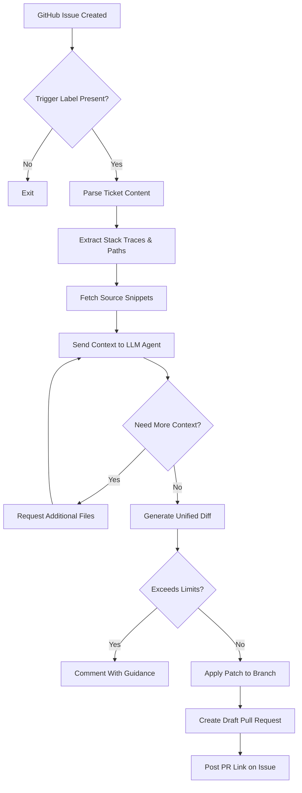

# 🤖 GitHub MCP Ticket Agent Library

> **An intelligent GitHub issue automation system that uses AI to analyze bug reports and automatically create fix proposals via pull requests.**

[](https://www.python.org/downloads/)
[](https://github.com/features/actions)
[](https://openai.com/)

---

## 📚 Table of Contents
- [🚀 What is TicketWatcher?](#-what-is-ticketwatcher)
- [✨ Key Features](#-key-features)
- [🏗️ How It Works](#%EF%B8%8F-how-it-works)
- [🗂️ Repository Layout](#%EF%B8%8F-repository-layout)
- [🛠️ Technologies Used](#%EF%B8%8F-technologies-used)
- [🧭 Onboarding Guide](#-onboarding-guide)
  - [1. Prerequisites](#1-prerequisites)
  - [2. Clone the Repository](#2-clone-the-repository)
  - [3. Create a Virtual Environment](#3-create-a-virtual-environment)
  - [4. Install Dependencies](#4-install-dependencies)
  - [5. Configure Environment Variables](#5-configure-environment-variables)
  - [6. Run the Test Suite](#6-run-the-test-suite)
  - [7. Dry-Run the Agent Locally](#7-dry-run-the-agent-locally)
- [⚙️ GitHub Actions Integration](#%EF%B8%8F-github-actions-integration)
- [📨 Triggering the Agent](#-triggering-the-agent)
- [🧩 Configuration Reference](#-configuration-reference)
- [☁️ Cloudflare Worker Template](#%E2%98%81%EF%B8%8F-cloudflare-worker-template)
- [🧪 Development Workflow](#-development-workflow)
- [🛡️ Safety Considerations](#%EF%B8%8F-safety-considerations)
- [🆘 Troubleshooting](#-troubleshooting)
- [📄 License](#-license)

---

## 🚀 What is TicketWatcher?
TicketWatcher is an automation library that transforms GitHub issues into actionable pull requests. When a bug report or traceback is filed, the agent parses the context, inspects the repository, and proposes a draft fix. The project is designed for teams that want to accelerate maintenance work while keeping humans in full control of the final merge.

## ✨ Key Features
- **🎯 Smart Issue Analysis** – Parses stack traces and error messages to prioritize relevant files.
- **🧠 AI-Powered Patching** – Delegates code reasoning and patch generation to OpenAI GPT models with structured prompts.
- **🛡️ Path Guardrails** – Enforces configurable allowlists so the agent touches only approved files.
- **📝 Draft PR Creation** – Opens draft pull requests with diffs, summaries, and testing notes for human review.
- **🔁 Iterative Context Fetching** – Requests additional snippets when more code context is required.
- **⚙️ GitHub Actions Ready** – Ships with a CLI wrapper tailored for workflow runs.
- **📦 Modular Architecture** – Separated helpers for stack parsing, snippet retrieval, diff application, and GitHub access reduce cognitive load.

## 🏗️ How It Works


## 🗂️ Repository Layout
```
├── src/
│   ├── app/                   # Intentionally buggy sample app for regression tests
│   └── ticketwatcher/         # Core automation library
│       ├── agent_llm.py       # Prompt + tool definitions for the AI agent
│       ├── handlers.py        # GitHub issue/comment event entrypoints
│       ├── snippets.py        # Context fetching helpers
│       ├── diff_utils.py      # Diff parsing & application utilities
│       ├── stackparse.py      # Traceback parsing logic
│       ├── paths.py           # Allowlist parsing & enforcement helpers
│       ├── config.py          # Centralized environment configuration
│       └── cli.py             # GitHub Actions-friendly CLI entrypoint
├── test/                      # Unit and regression tests
├── ticketwatcher-worker/      # Cloudflare Worker (Wrangler) template
├── docs/                      # Design docs and review notes
└── scripts/                   # Local utility scripts (e.g., integration test harness)
```

## 🛠️ Technologies Used
### Core
- **Python 3.9+** with typing and dataclasses
- **OpenAI GPT-4o** (or GPT-4) for agent reasoning
- **GitHub REST & GraphQL APIs** via `requests`

### Supporting Libraries
- `pytest` for tests
- `pydantic`-style validation (lightweight dataclasses instead)
- `python-dotenv` (optional) for local environment variable loading

## 🧭 Onboarding Guide
Follow these steps to get a local development environment running in under 10 minutes.

> 💡 **Fast path:** run `./scripts/bootstrap_ticketwatcher.sh` to clone the repo (if needed), set up a virtual environment, install dependencies, and scaffold a `.env` file automatically. Override the defaults with `REPO_URL`, `BRANCH`, `CLONE_DIR`, or `VENV_DIR` if you're targeting a fork.

### 1. Prerequisites
- Python **3.9 or newer**
- `pip` and `virtualenv` (or `uv`, `pipenv`, etc.)
- GitHub personal access token with `repo` scope (for local GitHub API calls)
- OpenAI API key with access to the desired model

### 2. Clone the Repository
```bash
git clone https://github.com/<your-username>/GITHUB-MCP-TICKET-AGENT-LIBRARY.git
cd GITHUB-MCP-TICKET-AGENT-LIBRARY
```

### 3. Create a Virtual Environment
```bash
python -m venv .venv
source .venv/bin/activate  # Windows: .venv\Scripts\activate
```

### 4. Install Dependencies
```bash
pip install --upgrade pip
pip install -r requirements.txt
# or: pip install -e .  # installs the package in editable mode
# or: pip install git+https://github.com/VickramC07/GITHUB-MCP-TICKET-AGENT-LIBRARY.git
```

### 5. Configure Environment Variables
Create a `.env` file (optional but recommended) or export the variables directly. A starter template lives at `.env.example` and is copied automatically when you run `scripts/bootstrap_ticketwatcher.sh`:
```bash
export OPENAI_API_KEY="sk-..."
export GITHUB_TOKEN="ghp_..."           # Optional for read-only operations
export ALLOWED_PATHS="src/,app/"        # Adjust as needed
export TICKETWATCHER_TRIGGER_LABELS="agent-fix,auto-pr"
```
Additional configuration knobs are documented in [Configuration Reference](#-configuration-reference).

### 6. Run the Test Suite
```bash
PYTHONPATH=src pytest
# To avoid networked tests: PYTHONPATH=src pytest -k "not live_test"
```
The sample `app/` package intentionally contains bugs for regression coverage; the real automation logic lives under `ticketwatcher/`.

### 7. Dry-Run the Agent Locally
Simulate a GitHub Actions run using a stored webhook payload:
```bash
PYTHONPATH=src python -m ticketwatcher.cli --event-file fixtures/sample_issue_event.json
```
Configure the model through `TICKETWATCHER_MODEL=gpt-4o-mini` (or similar) before running if you want to override the default.

## ⚙️ GitHub Actions Integration
1. Fork this repository and enable GitHub Actions in **Settings → Actions**.
2. Add repository secrets:
   - `OPENAI_API_KEY`
   - (Optional) `GH_TOKEN` if you prefer a custom token over the default `GITHUB_TOKEN`.
3. The provided workflow expects issues labelled `agent-fix` or `auto-pr`. When triggered, it uses `ticketwatcher.cli` as the entrypoint and posts draft PRs.

## 📨 Triggering the Agent
You can kick off an automated investigation in two ways:

### 🔖 Label-Based Trigger
Create or update an issue with one of the configured trigger labels:
```markdown
## Login failure after upgrade

**Traceback**
```
Traceback (most recent call last):
  File "src/app/auth.py", line 42, in get_user_profile
    return user["name"]
KeyError: 'name'
```
```

### 💬 Comment Command
Comment `/agent fix` (or your configured command) on an existing issue to force a run. The workflow handler reads the latest traceback in the thread, fetches relevant files, and produces a draft PR.

## 🧩 Configuration Reference
| Variable | Default | Description |
| --- | --- | --- |
| `TICKETWATCHER_TRIGGER_LABELS` | `agent-fix,auto-pr` | Labels that cause the workflow to run |
| `TICKETWATCHER_BRANCH_PREFIX` | `agent-fix/` | Prefix for generated branches |
| `TICKETWATCHER_PR_TITLE_PREFIX` | `agent: auto-fix for issue` | Applied to every draft PR title |
| `ALLOWED_PATHS` | `src/,app/` | Comma-separated list of directories/files the agent may modify (`""` means allow all) |
| `MAX_FILES` | `4` | Maximum number of files that can be modified per run |
| `MAX_LINES` | `200` | Maximum total changed lines in a diff |
| `DEFAULT_AROUND_LINES` | `60` | Context lines to fetch around each snippet |
| `OPENAI_API_KEY` | — | Required for LLM access |
| `GITHUB_TOKEN` | Provided by Actions | Used for GitHub API calls |

## ☁️ Cloudflare Worker Template
The [`ticketwatcher-worker/`](ticketwatcher-worker/) directory contains a Wrangler template for deploying a lightweight webhook relay on Cloudflare Workers.

### Deploy in 5 Steps
1. Install Wrangler:
   ```bash
   npm install -g wrangler
   ```
2. Navigate to the worker directory:
   ```bash
   cd ticketwatcher-worker
   ./bootstrap_worker.sh
   ```
3. Configure secrets:
   ```bash
   npx wrangler secret put GITHUB_TOKEN
   npx wrangler secret put GITHUB_WEBHOOK_SECRET
   npx wrangler secret put OPENAI_API_KEY
   ```
4. Update `wrangler.toml` with your account details and desired routes.
5. Deploy:
   ```bash
   npx wrangler deploy
   ```

The bootstrap script wires up npm dependencies and a `.dev.vars` template so you can run `npx wrangler dev` with minimal manual setup while still keeping secrets out of source control.

## 🧪 Development Workflow
1. **Create a feature branch** from `main`.
2. **Run focused tests** while iterating (`PYTHONPATH=src pytest test/test_paths_allowed.py`).
3. **Update documentation** when behavior changes.
4. **Open a PR** summarizing fixes, tests, and any manual verification steps.

## 🛡️ Safety Considerations
- Keep `ALLOWED_PATHS` narrow in production; accidental trailing commas are ignored to preserve restrictions.
- Draft PRs require manual review—never merge without verifying the changes.
- Monitor token usage; GPT models can incur significant costs for large repositories.

## 🆘 Troubleshooting
| Symptom | Likely Cause | Fix |
| --- | --- | --- |
| `ModuleNotFoundError: app.utils.stringy` | Sample app tests expect the sanitized helper module | Ensure `PYTHONPATH=src` when running tests |
| Workflow exits with `No event file found` | CLI run outside GitHub Actions without `--event-file` | Provide a local payload file via `--event-file path.json` |
| Agent refuses to touch files outside `src/` | Allowlist set to default | Set `ALLOWED_PATHS=""` to allow full access or add directories explicitly |
| `scripts/live_test.py` fails locally | Missing GitHub token | Export `GITHUB_TOKEN`/`GH_TOKEN` when running the integration test |

## 📄 License
A license file has not yet been provided. Add one before redistributing or deploying to ensure downstream users understand the terms of use.
