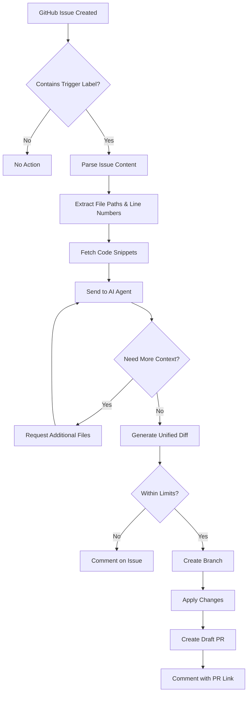

# 🤖 GitHub MCP Ticket Agent Library

> **An intelligent GitHub issue automation system that uses AI to analyze bug reports and automatically create fix proposals via pull requests.**

[](https://www.python.org/downloads/)
[](https://github.com/features/actions)
[](https://openai.com/)

## 🚀 What is TicketWatcher?

TicketWatcher is an intelligent automation library that transforms GitHub issues into actionable pull requests. When you create an issue with a bug report or traceback, the AI agent analyzes the code, understands the problem, and automatically creates a draft PR with a proposed fix.

### ✨ Key Features

- **🎯 Smart Issue Analysis**: Parses tracebacks and error messages to identify problematic files
- **🧠 AI-Powered Fixes**: Uses OpenAI's GPT models to generate intelligent code patches
- **🔒 Safe & Constrained**: Operates within configurable file path restrictions and change limits
- **📝 Draft PR Creation**: Automatically creates draft pull requests for human review
- **🔄 Iterative Context**: Can request additional code context when needed
- **⚡ GitHub Actions Ready**: Seamlessly integrates with GitHub workflows
- **🛡️ Path Validation**: Ensures only allowed files are modified

## 🏗️ How It Works



## 🛠️ Technologies Used

### Core Technologies
- **Python 3.9+**: Modern Python with type hints and async support
- **OpenAI API**: GPT-4/GPT-4o-mini for intelligent code analysis and fix generation
- **GitHub API v4**: Full repository manipulation capabilities
- **Requests**: HTTP client for API interactions

### Architecture Components
- **🎭 Agent LLM Module**: Intelligent AI agent with structured JSON responses
- **🔌 GitHub API Wrapper**: Comprehensive GitHub repository operations
- **📋 Event Handlers**: Issue and comment event processing
- **🖥️ CLI Interface**: Command-line interface for GitHub Actions integration

## 🚀 Quick Start

### 1. Install the library
however u install the library

### 2. Add GitHub Secrets
In your fork's repository settings, go to **Settings > Secrets and variables > Actions** and add these secrets:

- **`OPENAI_API_KEY`**: Your OpenAI API key

> **Note**: The `GITHUB_TOKEN` is automatically provided by GitHub Actions, so you don't need to add it manually.

### 3. Enable GitHub Actions
The workflow is already configured and will run automatically when:

- Issues are opened with `[agent-fix]` or `[auto-pr]` labels
- Comments contain `/agent fix`

**That's it!** 🎉 The system is now ready to use with GitHub Actions!

## 📖 Usage Guide

### Creating Issues That Trigger the Agent

The agent responds to issues with specific labels or patterns:

#### Method 1: Use Trigger Labels
Create an issue with labels like `agent-fix` or `auto-pr`:

```markdown
## Bug Report

**Error:**
```
Traceback (most recent call last):
  File "src/app/auth.py", line 42, in get_user_profile
    return user["name"]
KeyError: 'name'
```

**Expected Behavior:**
The function should handle cases where the user object doesn't have a 'name' key.
```

#### Method 2: Comment Trigger
Comment on any issue with `/agent fix` to trigger the agent:

```
/agent fix

Please analyze this authentication issue and propose a fix.
```


## ⚙️ Configuration Options

### Environment Variables

| Variable | Default | Description |
|----------|---------|-------------|
| `TICKETWATCHER_TRIGGER_LABELS` | `agent-fix,auto-pr` | Comma-separated labels that trigger the agent |
| `ALLOWED_PATHS` | `src/,app/` | Paths the agent is allowed to modify |
| `MAX_FILES` | `4` | Maximum files to modify per fix |
| `MAX_LINES` | `200` | Maximum lines to change per fix |
| `DEFAULT_AROUND_LINES` | `60` | Lines of context to fetch around error locations |
| `TICKETWATCHER_BASE_BRANCH` | `main` | Base branch for PR creation |
| `TICKETWATCHER_BRANCH_PREFIX` | `agent-fix/` | Prefix for generated branch names |
| `OPENAI_API_KEY` | *required* | Your OpenAI API key |
| `GITHUB_TOKEN` | *required* | GitHub Personal Access Token |

## 🔒 Security & Safety

### Built-in Safety Features

- **Path Restrictions**: Only modifies files in allowed directories
- **Change Limits**: Configurable limits on files and lines changed
- **Draft PRs**: All generated PRs are created as drafts for review

## 📚 API Reference

### TicketWatcherAgent
<details>

The core AI agent class that handles issue analysis and fix generation.

```python
from ticketwatcher.agent_llm import TicketWatcherAgent

agent = TicketWatcherAgent(
    model="gpt-4o-mini",
    allowed_paths=["src/"],
    max_files=4,
    max_total_lines=200
)

result = agent.run(
    ticket_title="Bug in authentication",
    ticket_body="Error occurs when...",
    snippets=[{"path": "src/auth.py", "start_line": 1, "end_line": 50, "code": "..."}]
)
```
</details>

### GitHub API Functions
<details>

```python
from ticketwatcher.github_api import (
    create_branch,
    create_or_update_file,
    create_pr,
    get_file_text
)

# Create a new branch
create_branch("feature/fix-auth", base="main")

# Update a file
create_or_update_file(
    path="src/auth.py",
    content_text="def fixed_function(): ...",
    message="Fix authentication bug",
    branch="feature/fix-auth"
)

# Create a pull request
pr_url, pr_number = create_pr(
    title="Fix authentication bug",
    head="feature/fix-auth",
    base="main",
    body="Automated fix for issue #123"
)
```
</details>


**Ready to automate your bug fixing workflow?** 🚀

Start by setting up the GitHub Action and creating your first issue with the `agent-fix` label. The agent will analyze your bug report and create a draft PR with a proposed fix - all automatically!

> 💡 **Pro Tip**: Start with small, well-defined bugs to see how the agent works, then gradually expand to more complex issues as you gain confidence in the system.
